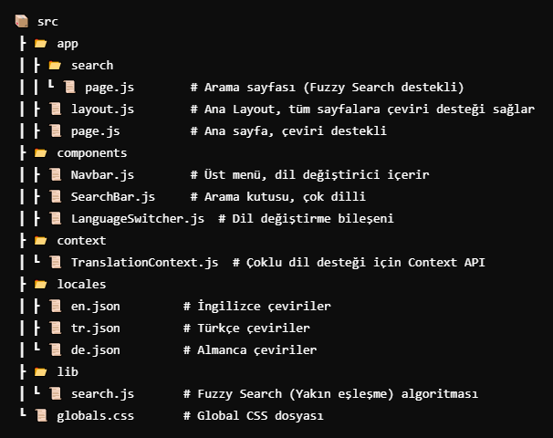

🌍 Next.js 14 Çok Dilli (Multilingual) Web Uygulaması
Bu proje Next.js 14 ve Tailwind CSS kullanılarak geliştirilmiş çok dilli (Türkçe, İngilizce, Almanca) bir web uygulamasıdır.
Kullanıcılar LanguageSwitcher bileşeni ile dili değiştirebilir ve sistem seçilen dili localStorage'da saklayarak kalıcı hale getirir.
Dil değiştirildiğinde tüm sayfa içeriği ve arama çubuğu otomatik olarak güncellenir.

🚀 Proje Özellikleri
✔ Next.js 14 ile Server-Side Rendering (SSR) ve Client-Side Rendering (CSR) uyumlu
✔ Tailwind CSS ile modern ve responsive tasarım
✔ Context API ile global dil yönetimi
✔ Dil değiştirildiğinde tüm bileşenler otomatik güncellenir
✔ Arama çubuğu (SearchBar) çok dilli ve Fuse.js ile yanlış yazımları tolere eder
✔ Next.js use client kullanımıyla optimizasyon sağlandı

📌 Kurulum
Öncelikle projeyi klonlayın:

bash
Kopyala
Düzenle
git clone https://github.com/kullaniciadi/nextjs-multilang.git
cd nextjs-multilang
Gerekli bağımlılıkları yükleyin:

bash
Kopyala
Düzenle
npm install
Geliştirme ortamında projeyi başlatın:

bash
Kopyala
Düzenle
npm run dev
📂 Proje Yapısı
python
Kopyala
Düzenle
 
🌍 Çok Dilli Yapı (Localization)
Uygulama 3 dil destekler:

Türkçe (tr)
İngilizce (en)
Almanca (de)